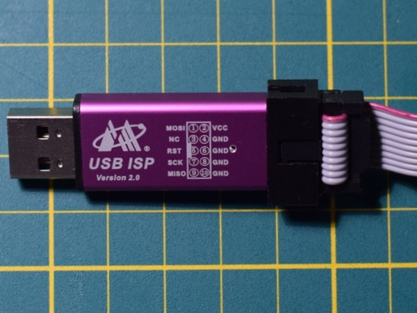
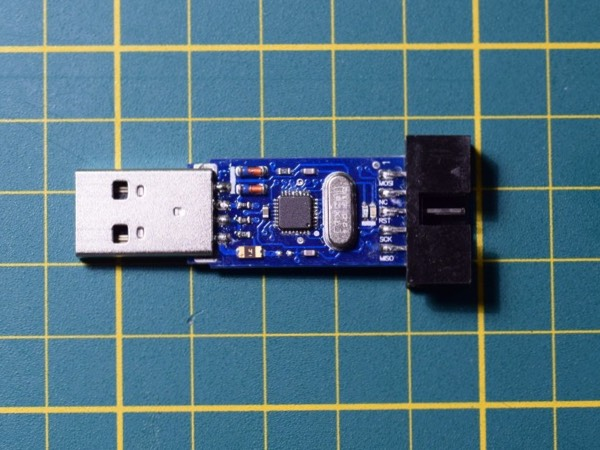
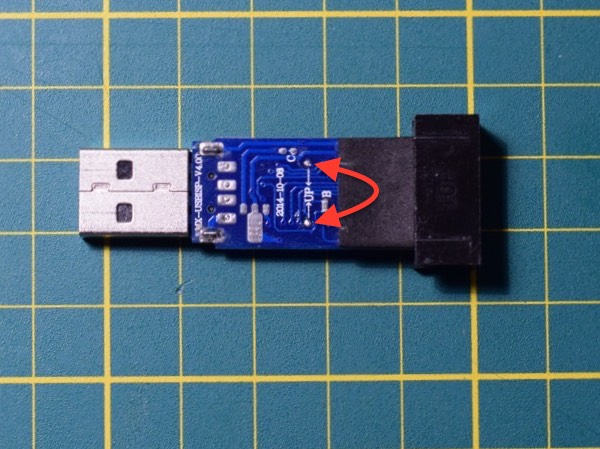

# USBasp on a clone

This is a fork of the original [USBasp](http://www.fischl.de/usbasp/) firmware (the file from [2011-05-28](http://www.fischl.de/usbasp/usbasp.2011-05-28.tar.gz)) tweaked to work with clone "USB ISP Version 2.0" devices (marked "MX-USBISP-V4.00" on the PCB). The original documentation and license is in `Readme.txt`.

Update: as reported by [erokui](https://github.com/erokui) and [steadramon](https://github.com/steadramon) devices marked with "MX-USBISP-V5.00" and "MX-USBISP-V6.00" work as well, the latter have to be flashed with `-p ATmega88P` option. Thanks guys!

## What is USB ISP?

This is a very cheap programmer for AVR-based microcontrollers available from many Chinese suppliers. Hardware-wise it appears to be very similar to [USBasp](http://www.fischl.de/usbasp/), but out of the box it works only with a Windows GUI utility from the manufacturer and does not work with [avrdude](http://www.nongnu.org/avrdude/).

Here is how it looks:

With the aluminium shell removed:

There is a "MX-USBISP-V4.00" label on the back of the PCB, see the photo below. If you have "V3.00" device, then better check [this post](https://www.sciencetronics.com/greenphotons/?p=938) instead.

## Quick Start

1. Remove the aluminium shell and put the device into the "self-programming" mode by connecting two pads on the back of the PCB marked with "UP":

	

2. Connect your favorite programmer to the header of USB ISP referring to the pinout on the case of the device. If you don't have one around, then use an Arduino with `ArduinoISP` example running on it. It is supported by avrdude as `avrisp`. Be sure to set baud rate to 19200.

3. Upload the prebuilt firmware in `./firmware/main.hex` and set the fuses to HFUSE=0xDD and LFUSE=0xFF.

4. Disable self-programming jumper.

Now connect the USB ISP to your computer. You should see the LED turning red for a bit and then turning blue. A USBasp HID device should appear in your USB tree. (Go to System Information > USB on a Mac.) Note that the device won't appear as a serial port, this is normal. 

Now you can check if avrdude can talk to it:

	 avrdude -c usbasp -P usb -p m328p

If you don't have anything connected to the programmer, then you'll see it complaining:

	$ avrdude -c usbasp  -P usb -p m328p

	avrdude: error: program enable: target doesn't answer. 1 
	avrdude: initialization failed, rc=-1

But you should not get any USB-related errors. 

Now connect it to a device to be programmed and read the flash first. If it works, then try writing something.

## Building from Sources

If you have `avr-gcc` toolchain installed, then navigate to `./firmware` and run:

	make main.hex

After this succeeds adjust the `Makefile` to suit your programmer and then do:

	make flash && make fuses

Good luck!

---
